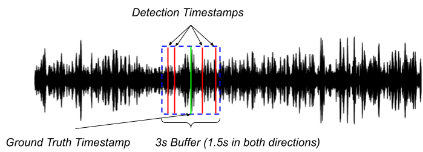
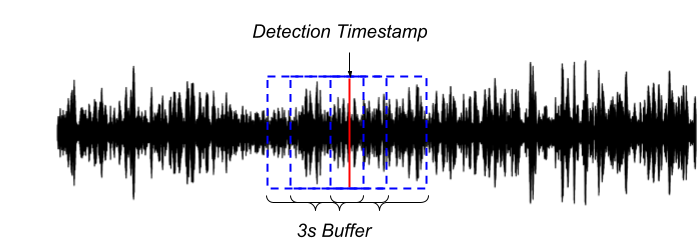

## Development set

### Audio 

The development set for this task is derived from the DCLDE 2013 dataset, specifically the selection that contains North Atlantic right whale (NARW) upcalls. 

### Annotation 

The annotations for the training set have been standardized as follows:

| filename | start | end |
| ------- | ------ | ---- |

Where:
- `filename`: Name of the file containing a NARW upcall.
- `start`: Start time in seconds from the beginning of the file where the upcall begins.
- `end`: End time in seconds where the upcall concludes.

Annotations labeled as uncertain have been excluded from the dataset. Additional dataset details are available on the [DCLDE 2013 dataset page](https://research-portal.st-andrews.ac.uk/en/datasets/dclde-2013-workshop-dataset).

For instance:

Consider an audio file named `NARW_20230601_0845.wav` containing a detected North Atlantic right whale upcall. The annotation for this file in the dataset might look like this:

| filename                  | start | end  |
|---------------------------|-------|------|
| NARW_20230601_0845.wav    | 123.5   | 125.2  |

Where:
- `filename`: `NARW_20230601_0845.wav` is the name of the audio file.
- `start`: `123.5` seconds is the time from the start of the audio file when the NARW upcall begins.
- `end`: `125.2` seconds is the time when the upcall ends.


## Evaluation set

### Audio 

The test data was collected in the Gulf of St. Lawrence and is a subset of the data used in a recent publication, which can be reviewed here. The test set includes 25 hours of recordings at 32KHz, with 1157 annotated NARW upcalls.

### Annotation 

The annotations for the test set include:

| filename   | timestamp |
| ---------- | --------- |

Where:
- `filename`: The name of the file where the detection occurred.
- `timestamp`: The detection time from the start of the file.

You may find both train an test set annotatiosn in the annotations folder.


## Task rules and submission

Participants are free to employ any preprocessing technique and network architecture. The onyl requirement is that the final output of your model MUST be a CSV file formatted following the annotation format of evaluation set described above. A 1.5-second buffer will be applied, where detections within this range from the annotation will be considered a true positive. Please see the examples in this page for a more in depth discussion on how to provide the timestamps.

Official challenge submission consists of:

- System output file (*.csv)
- Metadata file (*.yaml)
- Technical report explaining in sufficient detail the method (*.pdf)

System output should be presented as a single text-file (in CSV format, with a header row as shown in the example output below). 


## Evaluation metrics

Models will be evaluated based on precision, recall, F1 score, and false positive rate (FPR) per hour of recording. Please compute the performance metrics using the provided `metrics.py` script as follows:

```shell
python metrics.py annotations/annotations_test.csv detections.csv
```

If you are using a Windows operating system, you will need to replace the forward slashes (`/`) in the directory paths with backslashes (`\`).

A True Positive (TP) is recorded when a detection timestamp intersects with a ground truth buffer. A False Positive (FP) is incremented when a detection timestamp does not overlap with any ground truth buffer. Finally a False Negative (FN) is noted when there is a ground truth event that does not have a corresponding detection timestamp.

Note: The true positive count will only be incremented once per detection timestamp. For instance if multiple detection timestamps aligns with only one ground truth, the true positive count will be incremented only once. Similarly, if one detection timestamp aligns with multiple ground truths, the true positive count will be incremented for each ground truth.

The following images illustrates these scenarios:



In the image above, several detection timestamps are indicated by red lines, all of which fall within the same ground truth buffer marked by a green line and a blue box. Under this scenario, the count of true positives will be incremented only once, despite multiple detections.



In the image above, a single detection timestamp (red line) intersects with several ground truth buffers (blue boxes). In this case, the count of true positives will be incremented for each ground truth that the detection timestamp overlaps, despite there being "only one" detection.


## Codes to get started

We have prepared a sample code on [GitHub](https://github.com/GabrielDubus/MeridianOSmOSE_AutomaticDetectionOfCetaceans_Benchmark/blob/task1/task1/README.md) to serve as an example and to provide general guidance for approaching this task. This approach is intended solely as a reference, and you are not required to follow any specific steps outlined in it, except for running the metrics file. Nonetheless, this serves as a useful guideline for participating in the challenge.


